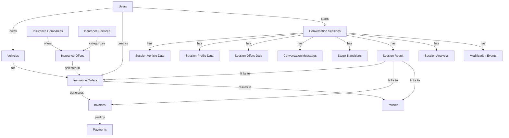

# 📊 هيكلية قاعدة البيانات الكاملة - نظام SAIA للتأمين

> **نظام إدارة التأمين الذكي - SAIA Insurance Broker System**  
> **قاعدة البيانات**: PostgreSQL  
> **Framework**: Django ORM

---

## 📑 جدول المحتويات

1. [المستخدمون والمركبات](#1-المستخدمون-والمركبات)
2. [شركات وخدمات التأمين](#2-شركات-وخدمات-التأمين)
3. [الطلبات والفواتير](#3-الطلبات-والفواتير)
4. [نظام المحادثات (Conversations)](#4-نظام-المحادثات)
5. [تكامل WhatsApp](#5-تكامل-whatsapp)
6. [بوابات الدفع](#6-بوابات-الدفع)
7. [نماذج AI Assistant](#7-نماذج-ai-assistant)

---

## 1. المستخدمون والمركبات

### 📋 `users` - المستخدمون

**الوصف**: يحتوي على بيانات العملاء والمستخدمين في النظام

| الحقل | النوع | القيود | الوصف |
|------|------|--------|-------|
| `id` | Integer | Primary Key | المعرف الفريد |
| `username` | String(150) | Unique, Required | اسم المستخدم |
| `password` | String | Required | كلمة المرور (مشفرة) |
| `first_name` | String(150) | Optional | الاسم الأول |
| `last_name` | String(150) | Optional | الاسم الأخير |
| `email` | Email | Optional | البريد الإلكتروني |
| `user_code` | String(20) | Unique, Auto | رمز المستخدم (USR12345678) |
| `national_id` | String(10) | Unique, Required | رقم الهوية الوطنية |
| `birth_date` | Date | Required | تاريخ الميلاد |
| `age` | Integer | Auto-calculated | العمر (محسوب تلقائياً) |
| `phone` | String(15) | Unique, Required | رقم الجوال |
| `city` | String(100) | Required | المدينة |
| `is_staff` | Boolean | Default: False | موظف؟ |
| `is_active` | Boolean | Default: True | نشط؟ |
| `is_superuser` | Boolean | Default: False | مدير؟ |
| `created_at` | DateTime | Auto | تاريخ الإنشاء |
| `updated_at` | DateTime | Auto | آخر تحديث |

**Indexes**:
- `national_id`
- `phone`
- `city`

---

### 🚗 `vehicles` - المركبات

**الوصف**: بيانات المركبات المملوكة للعملاء

| الحقل | النوع | القيود | الوصف |
|------|------|--------|-------|
| `id` | Integer | Primary Key | المعرف الفريد |
| `user_id` | ForeignKey | → users | المالك |
| `plate_no` | String(20) | Unique, Required | رقم اللوحة |
| `brand` | String(100) | Required | الماركة (تويوتا، هيونداي...) |
| `model` | String(100) | Required | الموديل (كامري، سوناتا...) |
| `model_year` | Integer | 1990-2030 | سنة الصنع |
| `vehicle_value` | Decimal(12,2) | Required | قيمة المركبة بالريال |
| `created_at` | DateTime | Auto | تاريخ الإنشاء |
| `updated_at` | DateTime | Auto | آخر تحديث |

**Indexes**:
- `plate_no`
- `user_id, created_at DESC`

**Computed Properties**:
- `age`: عمر المركبة (السنة الحالية - سنة الصنع)

---

## 2. شركات وخدمات التأمين

### 🏢 `insurance_companies` - شركات التأمين

**الوصف**: شركات التأمين المتعاونة مع النظام

| الحقل | النوع | القيود | الوصف |
|------|------|--------|-------|
| `id` | Integer | Primary Key | المعرف الفريد |
| `company_code` | String(50) | Unique, Required | رمز الشركة |
| `name_ar` | String(200) | Required | الاسم بالعربية |
| `name_en` | String(200) | Required | الاسم بالإنجليزية |
| `logo_url` | URL | Optional | رابط الشعار |
| `rating_score` | Decimal(3,2) | 0.00-5.00 | التقييم |
| `is_active` | Boolean | Default: True | نشط؟ |
| `created_at` | DateTime | Auto | تاريخ الإنشاء |
| `updated_at` | DateTime | Auto | آخر تحديث |

**أمثلة**: التعاونية، بوبا، الراجحي تكافل، أكسا

---

### 🛡️ `insurance_services` - خدمات التأمين

**الوصف**: أنواع خدمات التأمين المتاحة

| الحقل | النوع | القيود | الوصف |
|------|------|--------|-------|
| `id` | Integer | Primary Key | المعرف الفريد |
| `service_code` | String(50) | Unique, Required | رمز الخدمة |
| `name_ar` | String(200) | Required | الاسم بالعربية |
| `name_en` | String(200) | Required | الاسم بالإنجليزية |
| `service_type` | Choice | Required | نوع الخدمة |
| `description` | Text | Required | الوصف |
| `is_active` | Boolean | Default: True | نشط؟ |
| `created_at` | DateTime | Auto | تاريخ الإنشاء |
| `updated_at` | DateTime | Auto | آخر تحديث |

**أنواع الخدمات**:
- `AUTO_TPL`: تأمين ضد الغير
- `AUTO_COMP`: تأمين شامل
- `AUTO_VIP`: تأمين VIP

---

### 💎 `insurance_offers` - عروض التأمين

**الوصف**: العروض التأمينية المتاحة من الشركات

| الحقل | النوع | القيود | الوصف |
|------|------|--------|-------|
| `id` | Integer | Primary Key | المعرف الفريد |
| `company_id` | ForeignKey | → insurance_companies | شركة التأمين |
| `service_id` | ForeignKey | → insurance_services | خدمة التأمين |
| `offer_code` | String(50) | Unique, Required | رمز العرض |
| `coverage_type` | Choice | Required | نوع التغطية (tpl, comprehensive, vip) |
| **متطلبات العرض** |
| `min_age` | Integer | Default: 18 | الحد الأدنى لعمر السائق |
| `max_age` | Integer | Default: 70 | الحد الأقصى لعمر السائق |
| `min_vehicle_year` | Integer | Default: 2010 | أقدم سنة مركبة |
| `max_vehicle_value` | Decimal(12,2) | Optional | أقصى قيمة للمركبة |
| **التسعير** |
| `price_base` | Decimal(12,2) | Required | السعر الأساسي |
| `njm_discount_pct` | Decimal(5,2) | Default: 10.00 | نسبة خصم نجم % |
| `vat_rate` | Decimal(5,2) | Default: 15.00 | نسبة ضريبة القيمة المضافة % |
| **بيانات JSON** |
| `deductible_options` | JSONB | Default: [] | خيارات التحمل |
| `included_features_json` | JSONB | Default: [] | المزايا المضمنة |
| `optional_addons_json` | JSONB | Default: [] | الإضافات الاختيارية |
| **حالة العرض** |
| `is_active` | Boolean | Default: True | نشط؟ |
| `created_at` | DateTime | Auto | تاريخ الإنشاء |
| `updated_at` | DateTime | Auto | آخر تحديث |

**Indexes**:
- `company_id, service_id`
- `coverage_type, is_active`
- `price_base`

**Methods**:
- `calculate_final_price(has_njm_discount=False)`: حساب السعر النهائي مع الضريبة والخصومات

**مثال على deductible_options**:
```json
[
  {"amount": 0, "discount_pct": 0},
  {"amount": 500, "discount_pct": 5},
  {"amount": 1000, "discount_pct": 10}
]
```

---

## 3. الطلبات والفواتير

### 📝 `insurance_orders` - طلبات التأمين

**الوصف**: طلبات التأمين المقدمة من العملاء

| الحقل | النوع | القيود | الوصف |
|------|------|--------|-------|
| `id` | Integer | Primary Key | المعرف الفريد |
| `order_code` | String(50) | Unique, Auto | رمز الطلب (ORD1234567890) |
| `user_id` | ForeignKey | → users | العميل |
| `offer_id` | ForeignKey | → insurance_offers | العرض المختار |
| `vehicle_id` | ForeignKey | → vehicles | المركبة |
| `total_price` | Decimal(12,2) | Required | السعر الإجمالي |
| `status` | Choice | Default: draft | حالة الطلب |
| `has_njm_discount` | Boolean | Default: False | لديه خصم نجم؟ |
| `selected_deductible` | JSONB | Optional | التحمل المختار |
| `selected_addons` | JSONB | Default: [] | الإضافات المختارة |
| `notes` | Text | Optional | ملاحظات |
| `created_at` | DateTime | Auto | تاريخ الإنشاء |
| `updated_at` | DateTime | Auto | آخر تحديث |

**حالات الطلب**:
- `draft`: مسودة
- `awaiting_confirmation`: بانتظار التأكيد
- `pending_payment`: بانتظار الدفع
- `paid`: مدفوع
- `policy_issued`: صدرت الوثيقة
- `cancelled`: ملغي

**Indexes**:
- `user_id, created_at DESC`
- `status`
- `order_code`

---

### 🧾 `invoices` - الفواتير

**الوصف**: الفواتير المالية المرتبطة بالطلبات

| الحقل | النوع | القيود | الوصف |
|------|------|--------|-------|
| `id` | Integer | Primary Key | المعرف الفريد |
| `invoice_no` | String(50) | Unique, Auto | رقم الفاتورة (INV1234567890) |
| `order_id` | OneToOneField | → insurance_orders | الطلب |
| `amount` | Decimal(12,2) | Required | المبلغ |
| `status` | Choice | Default: pending | حالة الفاتورة |
| `expires_at` | DateTime | Required | تاريخ انتهاء الصلاحية |
| `created_at` | DateTime | Auto | تاريخ الإنشاء |
| `paid_at` | DateTime | Optional | تاريخ الدفع |

**حالات الفاتورة**:
- `pending`: معلقة
- `paid`: مدفوعة
- `expired`: منتهية
- `cancelled`: ملغاة

**Indexes**:
- `invoice_no`
- `status, expires_at`

**Computed Properties**:
- `is_expired`: هل انتهت صلاحية الفاتورة

---

### 💳 `payments` - المدفوعات

**الوصف**: سجل المعاملات المالية والمدفوعات

| الحقل | النوع | القيود | الوصف |
|------|------|--------|-------|
| `id` | Integer | Primary Key | المعرف الفريد |
| `invoice_id` | ForeignKey | → invoices | الفاتورة |
| `transaction_ref` | String(100) | Unique, Required | رقم المعاملة |
| `amount` | Decimal(12,2) | Required | المبلغ |
| `payment_method` | Choice | Required | طريقة الدفع |
| `status` | Choice | Required | حالة الدفعة |
| `gateway_response` | JSONB | Default: {} | استجابة بوابة الدفع |
| `created_at` | DateTime | Auto | تاريخ الإنشاء |
| `completed_at` | DateTime | Optional | تاريخ الإتمام |

**طرق الدفع**:
- `credit_card`: بطاقة ائتمان
- `debit_card`: بطاقة مدى
- `apple_pay`: Apple Pay
- `stc_pay`: STC Pay
- `bank_transfer`: تحويل بنكي

**حالات الدفعة**:
- `pending`: معلق
- `processing`: قيد المعالجة
- `completed`: مكتمل
- `failed`: فشل
- `refunded`: مسترد

**Indexes**:
- `transaction_ref`
- `status`

---

### 📄 `policies` - وثائق التأمين

**الوصف**: وثائق التأمين الصادرة

| الحقل | النوع | القيود | الوصف |
|------|------|--------|-------|
| `id` | Integer | Primary Key | المعرف الفريد |
| `policy_no` | String(50) | Unique, Auto | رقم الوثيقة (POL1234567890) |
| `order_id` | OneToOneField | → insurance_orders | الطلب |
| `start_date` | Date | Required | تاريخ البداية |
| `end_date` | Date | Required | تاريخ الانتهاء |
| `pdf_url` | URL | Required | رابط ملف PDF |
| `issued_at` | DateTime | Auto | تاريخ الإصدار |

**Indexes**:
- `policy_no`
- `start_date, end_date`

**Computed Properties**:
- `is_active`: هل الوثيقة سارية
- `days_remaining`: الأيام المتبقية

---

## 4. نظام المحادثات

### 💬 `conversation_sessions` - جلسات المحادثات

**الوصف**: الجلسة الرئيسية لكل محادثة مع العميل

| الحقل | النوع | القيود | الوصف |
|------|------|--------|-------|
| `id` | Integer | Primary Key | المعرف الفريد |
| `session_id` | UUID | Unique, Auto | معرف الجلسة الفريد |
| `user_identifier` | String(50) | Indexed | معرف المستخدم (رقم الهاتف) |
| `user_id` | ForeignKey | → users, Optional | المستخدم المسجل |
| `channel` | Choice | Default: whatsapp | قناة التواصل |
| **الحالة والمرحلة** |
| `status` | Choice | Default: active | حالة الجلسة |
| `current_stage` | Choice | Default: greeting | المرحلة الحالية |
| `previous_stage` | Choice | Optional | المرحلة السابقة |
| **إحصائيات** |
| `message_count` | Integer | Default: 0 | عدد الرسائل |
| `stage_transitions_count` | Integer | Default: 0 | عدد الانتقالات بين المراحل |
| **الروابط** |
| `order_id` | ForeignKey | → insurance_orders, Optional | الطلب الناتج |
| **التوقيتات** |
| `created_at` | DateTime | Auto | تاريخ الإنشاء |
| `updated_at` | DateTime | Auto | آخر تحديث |
| `last_activity_at` | DateTime | Auto | آخر نشاط |
| `completed_at` | DateTime | Optional | تاريخ الاكتمال |
| `expires_at` | DateTime | Optional | تاريخ الانتهاء |
| **بيانات إضافية** |
| `metadata` | JSONB | Default: {} | بيانات إضافية |

**حالات الجلسة**:
- `active`: نشطة
- `completed`: مكتملة
- `abandoned`: متروكة
- `expired`: منتهية
- `cancelled`: ملغاة

**قنوات التواصل**:
- `whatsapp`: واتساب
- `web_chat`: محادثة الويب
- `api`: API
- `mobile_app`: تطبيق الجوال

**مراحل المحادثة**:
1. `greeting`: الترحيب
2. `service_details`: تفاصيل الخدمة
3. `collecting_vehicle`: جمع بيانات السيارة
4. `confirming_vehicle`: تأكيد بيانات السيارة
5. `showing_offers`: عرض العروض
6. `offer_details`: تفاصيل العرض
7. `collecting_profile`: جمع بيانات العميل
8. `confirming_profile`: تأكيد بيانات العميل
9. `order_summary`: ملخص الطلب
10. `confirmation`: التأكيد النهائي
11. `payment_pending`: انتظار الدفع
12. `completed`: مكتمل

**Indexes**:
- `session_id`
- `user_identifier`
- `status, current_stage`
- `last_activity_at DESC`
- `channel, status`

**Methods**:
- `mark_completed()`: تحديد الجلسة كمكتملة
- `mark_abandoned()`: تحديد الجلسة كمتروكة
- `update_stage(new_stage)`: تحديث المرحلة

---

### 🚗 `session_vehicle_data` - بيانات السيارة في الجلسة

**الوصف**: بيانات السيارة المجمعة خلال المحادثة

| الحقل | النوع | القيود | الوصف |
|------|------|--------|-------|
| `id` | Integer | Primary Key | المعرف الفريد |
| `session_id` | OneToOneField | → conversation_sessions | الجلسة |
| `brand` | String(100) | Optional | الماركة |
| `model` | String(100) | Optional | الموديل |
| `year` | Integer | Optional | سنة الصنع |
| `value` | Decimal(12,2) | Optional | القيمة |
| `plate_no` | String(20) | Optional | رقم اللوحة |
| `service_type` | String(20) | Optional | نوع التأمين (comprehensive/tpl) |
| `is_confirmed` | Boolean | Default: False | تم التأكيد؟ |
| `confirmed_at` | DateTime | Optional | تاريخ التأكيد |
| `is_complete` | Boolean | Auto | البيانات مكتملة؟ |
| `vehicle_id` | ForeignKey | → vehicles, Optional | المركبة المسجلة |
| `created_at` | DateTime | Auto | تاريخ الإنشاء |
| `updated_at` | DateTime | Auto | آخر تحديث |

**Methods**:
- `check_completeness()`: التحقق من اكتمال البيانات

---

### 👤 `session_profile_data` - بيانات العميل في الجلسة

**الوصف**: بيانات العميل المجمعة خلال المحادثة

| الحقل | النوع | القيود | الوصف |
|------|------|--------|-------|
| `id` | Integer | Primary Key | المعرف الفريد |
| `session_id` | OneToOneField | → conversation_sessions | الجلسة |
| `national_id` | String(10) | Optional | رقم الهوية |
| `birth_date` | Date | Optional | تاريخ الميلاد |
| `full_name` | String(200) | Optional | الاسم الكامل |
| `phone` | String(15) | Optional | رقم الجوال |
| `email` | Email | Optional | البريد الإلكتروني |
| `city` | String(100) | Optional | المدينة |
| `is_confirmed` | Boolean | Default: False | تم التأكيد؟ |
| `confirmed_at` | DateTime | Optional | تاريخ التأكيد |
| `is_complete` | Boolean | Auto | البيانات مكتملة؟ |
| `created_at` | DateTime | Auto | تاريخ الإنشاء |
| `updated_at` | DateTime | Auto | آخر تحديث |

---

### 💰 `session_offers_data` - عروض الجلسة

**الوصف**: العروض المعروضة والمختارة في الجلسة

| الحقل | النوع | القيود | الوصف |
|------|------|--------|-------|
| `id` | Integer | Primary Key | المعرف الفريد |
| `session_id` | OneToOneField | → conversation_sessions | الجلسة |
| `shown_offers` | JSONB | Default: [] | العروض المعروضة (IDs) |
| `shown_at` | DateTime | Optional | تاريخ العرض |
| `selected_offer_id` | ForeignKey | → insurance_offers, Optional | العرض المختار |
| `selected_offer_data` | JSONB | Optional | بيانات العرض المختار |
| `selected_at` | DateTime | Optional | تاريخ الاختيار |
| `is_confirmed` | Boolean | Default: False | تم تأكيد العرض؟ |
| `confirmed_at` | DateTime | Optional | تاريخ التأكيد |
| `created_at` | DateTime | Auto | تاريخ الإنشاء |
| `updated_at` | DateTime | Auto | آخر تحديث |

---

### 💬 `conversation_messages` - رسائل المحادثة

**الوصف**: سجل كامل لجميع الرسائل في المحادثة

| الحقل | النوع | القيود | الوصف |
|------|------|--------|-------|
| `id` | Integer | Primary Key | المعرف الفريد |
| `session_id` | ForeignKey | → conversation_sessions | الجلسة |
| `message_id` | UUID | Unique, Auto | معرف الرسالة |
| `role` | Choice | Required | دور المرسل (user/assistant/system) |
| `message_type` | Choice | Default: text | نوع الرسالة |
| `content` | Text | Required | محتوى الرسالة |
| `stage_at_message` | Choice | Required | المرحلة عند إرسال الرسالة |
| `extracted_data` | JSONB | Optional | البيانات المستخرجة من الرسالة |
| `ai_analysis` | JSONB | Optional | تحليل AI |
| `metadata` | JSONB | Default: {} | بيانات إضافية |
| `created_at` | DateTime | Auto | تاريخ الإرسال |

**أدوار الرسائل**:
- `user`: المستخدم
- `assistant`: المساعد
- `system`: النظام

**أنواع الرسائل**:
- `text`: نص
- `image`: صورة
- `document`: مستند
- `location`: موقع
- `button_response`: رد زر
- `list_response`: رد قائمة

**Indexes**:
- `session_id, created_at`
- `role`
- `stage_at_message`

---

### 🔄 `stage_transitions` - انتقالات المراحل

**الوصف**: سجل تفصيلي لكل انتقال بين المراحل

| الحقل | النوع | القيود | الوصف |
|------|------|--------|-------|
| `id` | Integer | Primary Key | المعرف الفريد |
| `session_id` | ForeignKey | → conversation_sessions | الجلسة |
| `from_stage` | Choice | Required | من مرحلة |
| `to_stage` | Choice | Required | إلى مرحلة |
| `trigger_type` | String(50) | Required | نوع المحفز (user_input, ai_decision, system, timeout) |
| `trigger_message_id` | ForeignKey | → conversation_messages, Optional | الرسالة المحفزة |
| `is_successful` | Boolean | Default: True | نجح الانتقال؟ |
| `failure_reason` | Text | Optional | سبب الفشل |
| `data_snapshot` | JSONB | Default: {} | لقطة البيانات عند الانتقال |
| `duration_seconds` | Integer | Optional | المدة المستغرقة في المرحلة السابقة |
| `created_at` | DateTime | Auto | تاريخ الانتقال |

**Indexes**:
- `session_id, created_at`
- `from_stage, to_stage`

---

### 🎯 `session_results` - نتائج الجلسة

**الوصف**: النتائج النهائية وربط الجلسة بالطلب والفاتورة والوثيقة

| الحقل | النوع | القيود | الوصف |
|------|------|--------|-------|
| `id` | Integer | Primary Key | المعرف الفريد |
| `session_id` | OneToOneField | → conversation_sessions | الجلسة |
| `order_id` | ForeignKey | → insurance_orders, Optional | الطلب |
| `invoice_id` | ForeignKey | → invoices, Optional | الفاتورة |
| `policy_id` | ForeignKey | → policies, Optional | الوثيقة |
| **حالات الإنجاز** |
| `is_order_created` | Boolean | Default: False | تم إنشاء الطلب؟ |
| `is_invoice_created` | Boolean | Default: False | تم إنشاء الفاتورة؟ |
| `is_payment_completed` | Boolean | Default: False | تم الدفع؟ |
| `is_policy_issued` | Boolean | Default: False | تم إصدار الوثيقة؟ |
| **التوقيتات** |
| `order_created_at` | DateTime | Optional | تاريخ إنشاء الطلب |
| `invoice_created_at` | DateTime | Optional | تاريخ إنشاء الفاتورة |
| `payment_completed_at` | DateTime | Optional | تاريخ إتمام الدفع |
| `policy_issued_at` | DateTime | Optional | تاريخ إصدار الوثيقة |
| `total_amount` | Decimal(12,2) | Optional | المبلغ الإجمالي |
| `created_at` | DateTime | Auto | تاريخ الإنشاء |
| `updated_at` | DateTime | Auto | آخر تحديث |

---

### ✏️ `session_modification_events` - أحداث التعديل

**الوصف**: سجل أحداث التعديل والرجوع والإلغاء

| الحقل | النوع | القيود | الوصف |
|------|------|--------|-------|
| `id` | Integer | Primary Key | المعرف الفريد |
| `session_id` | ForeignKey | → conversation_sessions | الجلسة |
| `event_type` | Choice | Required | نوع الحدث |
| `stage_at_event` | Choice | Required | المرحلة عند الحدث |
| `target_stage` | Choice | Required | المرحلة المستهدفة |
| `data_before` | JSONB | Default: {} | البيانات قبل التعديل |
| `data_after` | JSONB | Default: {} | البيانات بعد التعديل |
| `reason` | Text | Optional | سبب التعديل |
| `trigger_message` | Text | Optional | رسالة المستخدم |
| `system_response` | Text | Optional | رد النظام |
| `is_successful` | Boolean | Default: True | نجح التعديل؟ |
| `metadata` | JSONB | Default: {} | بيانات إضافية |
| `created_at` | DateTime | Auto | تاريخ الحدث |

**أنواع الأحداث**:
- `cancel`: إلغاء كامل
- `edit_vehicle`: تعديل بيانات السيارة
- `edit_profile`: تعديل البيانات الشخصية
- `change_offer`: تغيير العرض
- `go_back`: رجوع للخطوة السابقة
- `restart`: إعادة البدء

**Indexes**:
- `session_id, created_at DESC`
- `event_type`
- `stage_at_event`

---

### 📊 `session_analytics` - تحليلات الجلسة

**الوصف**: إحصائيات وتحليلات تفصيلية للجلسة

| الحقل | النوع | القيود | الوصف |
|------|------|--------|-------|
| `id` | Integer | Primary Key | المعرف الفريد |
| `session_id` | OneToOneField | → conversation_sessions | الجلسة |
| **مدة الجلسة** |
| `total_duration_seconds` | Integer | Default: 0 | المدة الإجمالية (ثواني) |
| `active_duration_seconds` | Integer | Default: 0 | مدة النشاط (ثواني) |
| **إحصائيات الرسائل** |
| `user_messages_count` | Integer | Default: 0 | عدد رسائل المستخدم |
| `assistant_messages_count` | Integer | Default: 0 | عدد رسائل المساعد |
| `avg_response_time_seconds` | Float | Optional | متوسط وقت الرد |
| **إحصائيات المراحل** |
| `stages_visited` | JSONB | Default: [] | المراحل المزارة |
| `time_per_stage` | JSONB | Default: {} | الوقت لكل مرحلة |
| `drop_off_stage` | Choice | Optional | مرحلة التوقف/الخروج |
| **تقييم الجودة** |
| `ai_confidence_avg` | Float | Optional | متوسط ثقة AI |
| `extraction_accuracy` | Float | Optional | دقة الاستخراج |
| **إحصائيات التعديلات** |
| `total_modifications` | Integer | Default: 0 | إجمالي التعديلات |
| `cancel_count` | Integer | Default: 0 | عدد الإلغاءات |
| `edit_vehicle_count` | Integer | Default: 0 | عدد تعديلات السيارة |
| `edit_profile_count` | Integer | Default: 0 | عدد تعديلات البيانات الشخصية |
| `change_offer_count` | Integer | Default: 0 | عدد تغييرات العرض |
| `go_back_count` | Integer | Default: 0 | عدد الرجوع |
| `created_at` | DateTime | Auto | تاريخ الإنشاء |
| `updated_at` | DateTime | Auto | آخر تحديث |

**Methods**:
- `calculate_duration()`: حساب مدة الجلسة

---

## 5. تكامل WhatsApp

### 📱 `whatsapp_sessions` - جلسات واتساب

**الوصف**: جلسات WhatsApp وحفظ السياق

| الحقل | النوع | القيود | الوصف |
|------|------|--------|-------|
| `id` | Integer | Primary Key | المعرف الفريد |
| `phone_number` | String(15) | Unique, Required | رقم الجوال |
| `whatsapp_id` | String(100) | Optional | معرف واتساب |
| `user_id` | ForeignKey | → users, Optional | المستخدم |
| `session_status` | Choice | Default: active | حالة الجلسة |
| `conversation_history` | JSONB | Default: [] | سجل المحادثة |
| `last_message_at` | DateTime | Auto | آخر رسالة |
| `conversation_id` | String(100) | Optional | معرف المحادثة |
| `current_stage` | String(50) | Optional | المرحلة الحالية |
| `context_data` | JSONB | Default: {} | بيانات السياق |
| `created_at` | DateTime | Auto | تاريخ الإنشاء |

**حالات الجلسة**:
- `active`: نشط
- `inactive`: غير نشط
- `blocked`: محظور

---

## 6. بوابات الدفع

### 💳 `payment_gateway_configs` - إعدادات بوابات الدفع

**الوصف**: إعدادات بوابات الدفع المختلفة

| الحقل | النوع | القيود | الوصف |
|------|------|--------|-------|
| `id` | Integer | Primary Key | المعرف الفريد |
| `gateway_type` | Choice | Unique, Required | نوع البوابة |
| `api_key` | String(255) | Required | API Key |
| `api_secret` | String(255) | Optional | API Secret |
| `is_active` | Boolean | Default: True | نشط؟ |
| `is_test_mode` | Boolean | Default: True | وضع الاختبار؟ |

**أنواع البوابات**:
- `moyasar`: Moyasar
- `hyperpay`: HyperPay
- `stripe`: Stripe

---

## 7. نماذج AI Assistant

### 🧵 `ai_threads` - محادثات AI

**الوصف**: محادثات AI متوافقة مع django_ai_assistant

| الحقل | النوع | القيود | الوصف |
|------|------|--------|-------|
| `id` | Integer | Primary Key | المعرف الفريد |
| `name` | String(255) | Optional | اسم المحادثة |
| `created_by_id` | ForeignKey | → users, Optional | المنشئ |
| `assistant_id` | String(255) | Default: insurance-assistant | معرف المساعد |
| `conversation_session_id` | ForeignKey | → conversation_sessions, Optional | جلسة المحادثة |
| `created_at` | DateTime | Auto | تاريخ الإنشاء |
| `updated_at` | DateTime | Auto | آخر تحديث |

**Indexes**:
- `created_at DESC`
- `assistant_id`

**Methods**:
- `get_messages(include_extra_messages=False)`: الحصول على رسائل المحادثة

---

### 💬 `ai_messages` - رسائل AI

**الوصف**: رسائل AI متوافقة مع django_ai_assistant

| الحقل | النوع | القيود | الوصف |
|------|------|--------|-------|
| `id` | Integer | Primary Key | المعرف الفريد |
| `thread_id` | ForeignKey | → ai_threads | المحادثة |
| `message_type` | Choice | Default: human | نوع الرسالة |
| `content` | Text | Required | المحتوى |
| `extra_data` | JSONB | Default: {} | بيانات إضافية (stage, data, etc.) |
| `created_at` | DateTime | Auto | تاريخ الإنشاء |

**أنواع الرسائل**:
- `human`: رسالة المستخدم
- `ai`: رسالة المساعد
- `system`: رسالة النظام
- `tool`: استدعاء أداة

**Indexes**:
- `thread_id, created_at`
- `message_type`

---

## 🔗 العلاقات الرئيسية بين الجداول

### مخطط العلاقات (ERD)



---

## 📈 إحصائيات قاعدة البيانات

| المجموعة | عدد الجداول | الوصف |
|---------|------------|-------|
| المستخدمون والمركبات | 2 | Users, Vehicles |
| شركات وخدمات التأمين | 3 | Companies, Services, Offers |
| الطلبات والمدفوعات | 4 | Orders, Invoices, Payments, Policies |
| نظام المحادثات | 9 | Sessions, Messages, Transitions, Analysis |
| تكامل WhatsApp | 1 | WhatsApp Sessions |
| بوابات الدفع | 1 | Payment Gateway Configs |
| نماذج AI | 2 | Threads, Messages |
| **المجموع** | **22 جدول** | |

---

## 🔐 الفهارس (Indexes) المهمة

### فهارس الأداء العالي:
1. **users**: `national_id`, `phone`, `city`
2. **vehicles**: `plate_no`, `(user_id, created_at DESC)`
3. **insurance_offers**: `(company_id, service_id)`, `(coverage_type, is_active)`, `price_base`
4. **insurance_orders**: `(user_id, created_at DESC)`, `status`, `order_code`
5. **conversation_sessions**: `session_id`, `user_identifier`, `(status, current_stage)`, `last_activity_at DESC`
6. **conversation_messages**: `(session_id, created_at)`, `role`, `stage_at_message`
7. **stage_transitions**: `(session_id, created_at)`, `(from_stage, to_stage)`

---

## 📝 ملاحظات مهمة

### 🔹 حقول UUID:
- `conversation_sessions.session_id`
- `conversation_messages.message_id`

### 🔹 حقول JSON/JSONB:
- `insurance_offers`: deductible_options, included_features_json, optional_addons_json
- `conversation_sessions`: metadata
- `conversation_messages`: extracted_data, ai_analysis, metadata
- `session_analytics`: stages_visited, time_per_stage
- `whatsapp_sessions`: conversation_history, context_data

### 🔹 حقول Auto-generated:
- `user_code`: USR12345678
- `order_code`: ORD1234567890
- `invoice_no`: INV1234567890
- `policy_no`: POL1234567890

### 🔹 حقول محسوبة (Computed):
- `users.age`: محسوب من birth_date
- `vehicles.age`: محسوب من model_year
- `invoices.is_expired`: محسوب من expires_at
- `policies.is_active`: محسوب من start_date و end_date
- `policies.days_remaining`: محسوب من end_date
- `session_vehicle_data.is_complete`: محسوب من الحقول المطلوبة
- `session_profile_data.is_complete`: محسوب من الحقول المطلوبة

---

## 🎯 سيناريو دورة الحياة الكاملة

```
1. [conversation_sessions] يبدأ عميل محادثة جديدة
   ↓
2. [session_vehicle_data] يدخل بيانات السيارة
   ↓
3. [session_offers_data] يحصل على عروض ويختار واحد
   ↓
4. [session_profile_data] يدخل بياناته الشخصية
   ↓
5. [insurance_orders] يتم إنشاء طلب تأمين
   ↓
6. [invoices] تصدر فاتورة
   ↓
7. [payments] يتم الدفع
   ↓
8. [policies] تصدر وثيقة التأمين
   ↓
9. [session_results] يتم تسجيل النتيجة النهائية
   ↓
10. [session_analytics] يتم حساب التحليلات والإحصائيات
```

---

## 📞 معلومات إضافية

- **إجمالي الجداول**: 22
- **قاعدة البيانات**: PostgreSQL
- **Framework**: Django ORM
- **نوع البيانات المرنة**: JSONB
- **المحرك**: Gemini LLM
- **القنوات المدعومة**: WhatsApp, Web Chat, API, Mobile App

---

**تم التوليد بواسطة**: نظام SAIA للتأمين الذكي  
**التاريخ**: 2026-01-21  
**الإصدار**: 1.0
